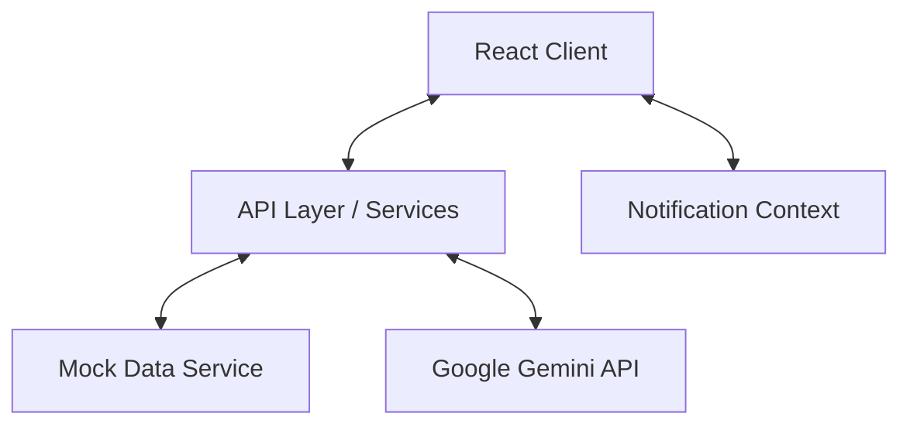

# Technical Documentation

## Architecture Overview

The application follows a **Single Page Application (SPA)** architecture built with React. 

## State Management
*   **Local State**: Managed via `useState` for form inputs and UI toggles.
*   **Global State**: Managed via React Context API (`NotificationContext`) for toasts and alerts that persist across route changes.
*   **Authentication**: Uses JWT tokens for secure authentication. Tokens are managed via HTTP requests and stored appropriately for API calls.

## Data Models (Types)

### Student
| Field | Type | Description |
|-------|------|-------------|
| `id` | string | Unique identifier |
| `jamb_number` | string | Primary Key for student login |
| `clearance_record` | Object | Nested clearance data |

### ClearanceItem
| Field | Type | Description |
|-------|------|-------------|
| `office_type` | Enum | ADMISSIONS, BURSARY, etc. |
| `status` | Enum | PENDING, APPROVED, REJECTED |
| `documents` | Array | List of uploaded documents |

## API Integration Guide (Backend Simulation)

The current application uses `services/mockData.ts` to simulate a backend. For production integration, implement the following endpoints:

### Authentication
*   **POST** `/api/auth/login`
    *   Body: `{ jamb_number, password }` or `{ email, password }`
    *   Response: `{ token, user_role, user_data }`

### Clearance Operations
*   **GET** `/api/clearance/:studentId`
    *   Returns full clearance record.
*   **POST** `/api/clearance/upload`
    *   Body: `Multipart/Form-Data` (File + Meta)
    *   Response: `{ document_id, url }`
*   **PATCH** `/api/clearance/review/:itemId`
    *   Body: `{ status: 'APPROVED' | 'REJECTED', comment: string }`
    *   *Officer Access Only*

## Integration with University Systems

To fetch student biodata, the system integrates with the central University Portal API:

1.  **Endpoint**: `https://portal.lasustech.edu.ng/api/v1/student/verify`
2.  **Method**: `POST`
3.  **Headers**: `Authorization: Bearer {API_SECRET}`
4.  **Payload**: `{ jamb_number: string }`

**Rate Limits**: 1000 requests per minute.

## AI Document Analysis
Implemented in `services/geminiService.ts`.
*   **Model**: `gemini-3-flash-preview`
*   **Purpose**: Validates if an uploaded image matches the expected document type (e.g., checks if a "Birth Certificate" upload actually contains text relating to birth records).
